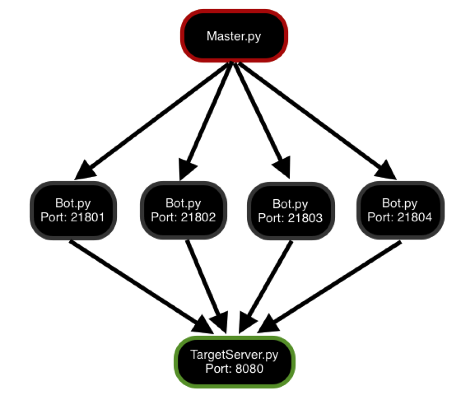

#py-botnet

## Description

The purpose of this project was to gain experience with Socket programming by creating a Distributed Denial of Service Botnet. The program synchronizes Bots in a Botnet by using a coordinator; the Bots then attack the Target Server at the specified time. 
## Disclaimer
This program is meant for educational purposes only. DDoS attacks are illegal in most countries, so only use this program on machines that you own or are authorized to use.

## Design
The Botnet consists of a separate script for the Bot, Master and the Target Server; it also includes a utility script containing utility methods which other scripts can call.

The overall design is quite simple, and each component is self-contained in their respective script file, with the exception that each of them uses components from Util.py. Each script also takes command line arguments and has help documentation which can be viewed by running the script with a –h flag.

The figure below shows a visual representation of the setup and how the scripts interact with each other. In the figure, the hostnames are not specified because all the scripts are assumed to be running on the localhost.



### Bot.py
The Bot script creates a socket on the specified port and starts listening for the Master. Once the Master makes the connection, it is first authenticated using a handshake process, if the authentication is successful, the Bot sends the Master it’s current time. The Master then replies with a message containing the Target Server’s hostname and port number, as well as when to attack, taking into account any time difference between the Bot and the Master.

The Bot then sleeps until the specified attack time. Once it is time to attack, the Bot connects to the Target Server on the specified port and starts sending messages for 30 seconds, i.e. it simulates a DoS attack. Once the 30 seconds are up and the attack is complete, the Bot disconnects from the Target Server and exits.

### Master.py
The Master script reads the text file containing the Bot information and then loops through each Bot entry. For each Bot, it connects at the specified port and authenticates itself through a handshake process. Once authenticated, the Master asks the Bot for it’s current time and determines any time difference between itself and the Bot. It then sends the Bot the Target Server’s hostname and the port on which to attack, as well as when to attack, while accounting for any time difference between itself and the Bot. Once this information has been relayed to the Bot, it continues to the next Bot until all of the Bots are notified about the attack.

### TargetServer.py
The Target Server script simply runs a dummy server on the specified port. It listens on the port for clients to connect, for each new clients, it creates a new thread to handle the client. Within the client handler, it simply continues to receive data from the client until the client terminates the connection. In this case, it will listen for Bots to connect, once they are connected, a separate thread will be created for each. Within the thread, it will continue receive data from the Bot for 30 seconds. 

## Usage
In order to run the Botnet, the following steps need to be taken. Note however that a demo.py script has been created in order to automate the creation of four Bots.

1) Start the Target Server by running the following command:

```
$ python TargetServer.py –p <port number> | tee log.txt
```

2) Start the Bot by running the following command:

```
$ python Bot.py –p <port number>
```

3) Repeat Step 2 for each Bot and record the hostname and port number in bots_list.txt

4) Run the Master with the following command:

```
$ python Master.py –t <target host> -p <target host’s port number> -d <when to attack>
```

Note that the time to attack is specified by how many seconds from now the attack should occur. 

5) Wait for the Bots to attack; once the attack is completed, use Ctrl-C to stop each script.


## Known Issues and Bugs

* program does not handle different time zones (Solution: use UTC time) 
* on some machines if the attack rate of the Bot is too fast, i.e. less than 0.1 ms, some issues might be encountered 

## End Notes
This project is published under the Apache License Version 2.0.

# DdosBotnet

